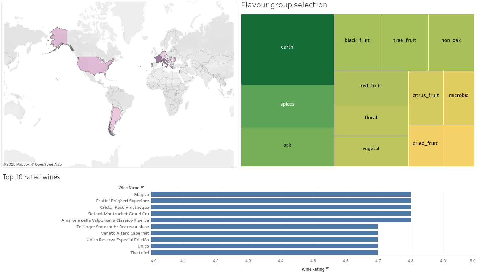

# Wiwino App for wine selection and analysis.

## Creating a webapp for internal usage by Wiwino.

This repository contains the source code for a webapp and DB of the fictional Wiwino wine company. The webapp is supposed to be used internally by the company to support their wine experts with recommendations for clients and overall better analysis of wine qualities and characteristics and their relationship to costumer feedback. 
 

## Installation

 
The Wiwino webapp uses [python 3.10.6+](https://www.python.org), [streamlit](https://streamlit.io), [sqlite](https://www.sqlite.org/index.html) alongside external tools like [tableau](https://www.tableau.com) for analysis and visualization.
 
The webapp has been deployed [here](https://winemarketanalysis-3qumvsapp43avwalh5bq2ex.streamlit.app/), but if you want to run it locally, you need to install the required libraries using `pip install -r requirements.txt` and run `streamlit run 1_🏠_Home.py` on the root folder of this repository.

## Usage

The webapp can be found on [this link](https://winemarketanalysis-3qumvsapp43avwalh5bq2ex.streamlit.app/). 
In order to run the app locally check the installation section.

## Context

This project was done by [Sacha Scheurer](https://github.com/sachinovitch), [Bo Cao](https://github.com/Spike815), [Khosro Mehdi Khanlou](https://github.com/Khosro2023) and [Henrique Rauen](https://github.com/henrique-rauen) during  the last week of august 2023 as part of the becode data analyst/data engineering training.
